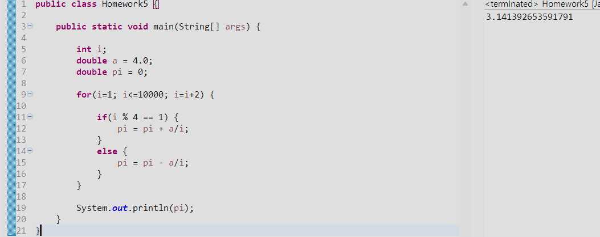
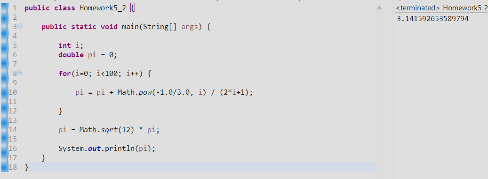
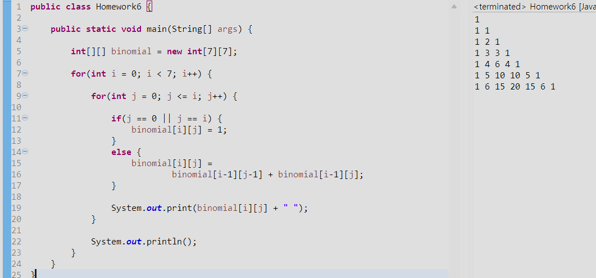
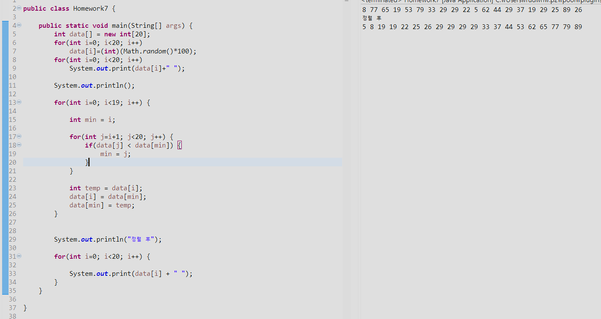
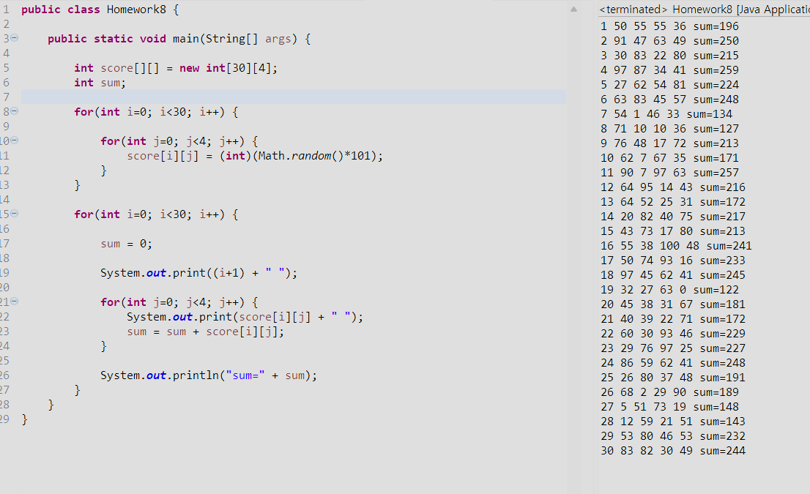
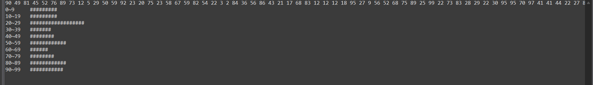
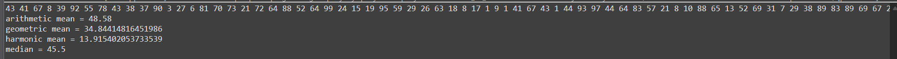
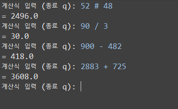

OOP 2026
```java
public class Homework1 {
    public static void main(String[] args) {

        int i, j;

        for(i=0; i<10; i++) {
            for(j=0; j<=i; j++) {
                System.out.print("*");
            }
            System.out.println();
        }

        System.out.println();

        for(i=0; i<10; i++) {
            for(j=i; j<10; j++) {
                System.out.print("*");
            }
            System.out.println();
        }

        System.out.println();

        for(i=0; i<10; i++) {
            for(j=0; j<9-i; j++) {
                System.out.print(" ");
            }
            for(; j<10; j++) {
                System.out.print("*");
            }
            System.out.println();
        }

        System.out.println();

        for(i=0; i<10; i++) {
            for(j=0; j<i; j++) {
                System.out.print(" ");
            }
            for(; j<10; j++) {
                System.out.print("*");
            }
            System.out.println();
        }
    }
}
```

```java
public class Homework2 {
    public static void main(String[] args) {

        int a = 1, b = 1, c;

        for(int i = 1; i <= 20; i++) {
            System.out.print(a + " ");

            c = a + b;
            a = b;
            b = c;
        }
    }
}
```

```java
public class Homework3 {
    public static void main(String[] args) {

        int a = 1, b = 1, c;
        double ratio;

        for(int i = 3; i <= 20; i++) {
            c = a + b;
            ratio = (double)c / b;

            System.out.println(c + "/" + b + "=" + ratio);

            a = b;
            b = c;
        }
    }
}
```

```java
public class Homework4 {
    public static void main(String[] args) {

        int i, j;

        for(i = 1; i <= 9; i++) {
            for(j = 1; j <= 9; j++) {
                System.out.print(j + "*" + i + "=" + (j * i) + "\t");
            }
            System.out.println();
        }
    }
}
```

```java
public class Homework5 {

    public static void main(String[] args) {

        int i;
        double a = 4.0;
        double pi = 0;

        for(i=1; i<=10000; i=i+2) {

            if(i % 4 == 1) {
                pi = pi + a/i;
            }
            else {
                pi = pi - a/i;
            }
        }

        System.out.println(pi);
    }
}
```

```java
public class Homework5_2 {

    public static void main(String[] args) {

        int i;
        double pi = 0;

        for(i=0; i<100; i++) {

            pi = pi + Math.pow(-1.0/3.0, i) / (2*i+1);

        }

        pi = Math.sqrt(12) * pi;

        System.out.println(pi);
    }
}
```

```java
public class Homework6 {

    public static void main(String[] args) {

        int[][] binomial = new int[7][7];

        for(int i = 0; i < 7; i++) {

            for(int j = 0; j <= i; j++) {

                if(j == 0 || j == i) {
                    binomial[i][j] = 1;
                }
                else {
                    binomial[i][j] =
                            binomial[i-1][j-1] + binomial[i-1][j];
                }

                System.out.print(binomial[i][j] + " ");
            }

            System.out.println();
        }
    }
}
```

```java

public class Homework7 {

	public static void main(String[] args) {
		int data[] = new int[20];
		for(int i=0; i<20; i++)
		    data[i]=(int)(Math.random()*100);
		for(int i=0; i<20; i++)
		    System.out.print(data[i]+" ");
		
		System.out.println();
		
		for(int i=0; i<19; i++) {

            int min = i;

            for(int j=i+1; j<20; j++) {
                if(data[j] < data[min]) {
                    min = j;
                }
            }

            int temp = data[i];
            data[i] = data[min];
            data[min] = temp;
        }


        System.out.println("정렬 후");

        for(int i=0; i<20; i++) {
        
        	System.out.print(data[i] + " ");
        }
	}
        
}
```

```java
public class Homework8 {

    public static void main(String[] args) {

        int score[][] = new int[30][4];
        int sum;

        for(int i=0; i<30; i++) {

            for(int j=0; j<4; j++) {
                score[i][j] = (int)(Math.random()*101);
            }
        }

        for(int i=0; i<30; i++) {

            sum = 0;

            System.out.print((i+1) + " ");

            for(int j=0; j<4; j++) {
                System.out.print(score[i][j] + " ");
                sum = sum + score[i][j];
            }

            System.out.println("sum=" + sum);
        }
    }
}
```



```java
public class Homework10 {

    public static void main(String[] args) {

        int array_count, max_value, bin_size, display_scale, hist_size;

        if(args.length != 4)
            return;

        array_count = Integer.parseInt(args[0]);
        max_value = Integer.parseInt(args[1]);
        bin_size = Integer.parseInt(args[2]);
        display_scale = Integer.parseInt(args[3]);

        hist_size = max_value / bin_size;

        int[] arr = new int[array_count];
        int[] hist = new int[hist_size];

        for(int i=0; i<array_count; i++) {
            arr[i] = (int)(Math.random() * max_value);
        }

        for(int i=0; i<array_count; i++) {
            System.out.print(arr[i] + " ");
        }

        System.out.println();

        for(int i=0; i<array_count; i++) {
            hist[arr[i] / bin_size]++;
        }

        for(int i=0; i<hist_size; i++) {

            System.out.print(
                (i * bin_size) + "~" +
                (i * bin_size + bin_size - 1) + "\t"
            );

            for(int j=0; j<hist[i] / display_scale; j++) {
                System.out.print("#");
            }

            System.out.println();
        }
    }
}
```




```java
import java.util.Arrays;

public class Homework11 {

    public static void main(String[] args) {

        int array_count;

        if(args.length != 1)
            return;

        array_count = Integer.parseInt(args[0]);

        int[] arr = new int[array_count];

        for(int i=0; i<array_count; i++) {
            arr[i] = (int)(Math.random()*99) + 1;
        }

        for(int i=0; i<array_count; i++) {
            System.out.print(arr[i] + " ");
        }

        System.out.println();

        // 산술평균
        double sum = 0;

        for(int i=0; i<array_count; i++) {
            sum = sum + arr[i];
        }

        double arithmetic = sum / array_count;

        System.out.println("arithmetic mean = " + arithmetic);


        // 기하평균
        double prod = 1;

        for(int i=0; i<array_count; i++) {
            prod = prod * arr[i];
        }

        double geometric =
                Math.pow(prod, 1.0 / array_count);

        System.out.println("geometric mean = " + geometric);


        // 조화평균
        double reciprocalSum = 0;

        for(int i=0; i<array_count; i++) {
            reciprocalSum =
                    reciprocalSum + 1.0 / arr[i];
        }

        double harmonic =
                array_count / reciprocalSum;

        System.out.println("harmarmonic mean = " + harmonic);


        // 중앙값
        Arrays.sort(arr);

        double median;

        if(array_count % 2 == 1) {
            median = arr[array_count / 2];
        }
        else {
            median =
                    (arr[array_count/2 - 1]
                    + arr[array_count/2]) / 2.0;
        }

        System.out.println("median = " + median);
    }
}
```




```java
import java.util.Scanner;

public class Homework13 {

    public static void main(String[] args) {

        Scanner scanner = new Scanner(System.in);

        while(true) {

            System.out.print("계산식 입력 (종료 q): ");
            String inputString = scanner.nextLine();

            if(inputString.equals("q")) {
                break;
            }

            String[] arrOfStr = inputString.split(" ");

            // 숫자 2개
            if(arrOfStr.length == 3) {

                double a = Double.parseDouble(arrOfStr[0]);
                String op = arrOfStr[1];
                double b = Double.parseDouble(arrOfStr[2]);

                double result = 0;

                if(op.equals("+")) {
                    result = a + b;
                }
                else if(op.equals("-")) {
                    result = a - b;
                }
                else if(op.equals("#")) {
                    result = a * b;
                }
                else if(op.equals("/")) {
                    result = a / b;
                }

                System.out.println("= " + result);
            }


            // 숫자 3개
            else if(arrOfStr.length == 5) {

                double a = Double.parseDouble(arrOfStr[0]);
                String op1 = arrOfStr[1];
                double b = Double.parseDouble(arrOfStr[2]);
                String op2 = arrOfStr[3];
                double c = Double.parseDouble(arrOfStr[4]);

                double result = 0;

                if((op1.equals("+") || op1.equals("-"))
                        && (op2.equals("#") || op2.equals("/"))) {

                    double temp = 0;

                    if(op2.equals("#")) {
                        temp = b * c;
                    }
                    else {
                        temp = b / c;
                    }

                    if(op1.equals("+")) {
                        result = a + temp;
                    }
                    else {
                        result = a - temp;
                    }
                }

                else {

                    double temp = 0;

                    if(op1.equals("+")) {
                        temp = a + b;
                    }
                    else if(op1.equals("-")) {
                        temp = a - b;
                    }
                    else if(op1.equals("#")) {
                        temp = a * b;
                    }
                    else if(op1.equals("/")) {
                        temp = a / b;
                    }

                    if(op2.equals("+")) {
                        result = temp + c;
                    }
                    else if(op2.equals("-")) {
                        result = temp - c;
                    }
                    else if(op2.equals("#")) {
                        result = temp * c;
                    }
                    else if(op2.equals("/")) {
                        result = temp / c;
                    }
                }

                System.out.println("= " + result);
            }
        }

        scanner.close();
    }
}
```


